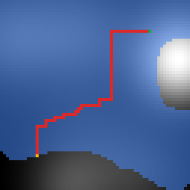
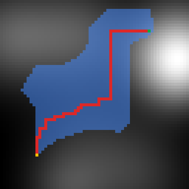

# A* vs. Branch and Bound on Terrain Maps

How much does a good heuristic save when planning a least-effort walking route over a height map? This repo compares branch and bound (uniform-cost search) with A* under five heuristics on the course map and three synthetic 64×64 terrains, over 500 random start/goal pairs.

**Report:** [`report/report.pdf`](report/report.pdf) (article format) or [University of Sheffield report format](report/USFD_Academic-_Report_LaTeX-Template/main.pdf)

 

*Same start and goal, same optimal route (cost 95). Left: branch and bound expands 3322 cells. Right: A\* with Manhattan+Ascent expands 1148.*

## The problem

A rambler moves one cell up, down, left or right. Level and downhill steps cost 1. Climbing costs 1 plus the height gained. The goal is the cheapest route between two cells.

## Findings

| Nodes expanded vs. branch and bound | tmc16 | smooth64 | rolling64 | rugged64 |
|---|---|---|---|---|
| A* Euclidean | 0.83 | 0.57 | 0.74 | 0.85 |
| A* Manhattan | 0.79 | 0.45 | 0.66 | 0.81 |
| A* Ascent | 0.79 | 0.82 | 0.81 | 0.91 |
| **A* Manhattan+Ascent** | **0.56** | **0.25** | **0.48** | **0.72** |
| A* Absolute height (inadmissible) | 0.76 | 0.71 | 1.11 | 1.10 |

- All four admissible heuristics returned an optimal route on every pair.
- Manhattan distance plus remaining ascent is admissible and consistent (proof in the report), and it was the best heuristic on every map.
- The savings shrink on rugged terrain. The fraction of the true cost a heuristic sees from the start, h(start)/C\*, drops from 0.79 to 0.27 for the best heuristic, and the synthetic maps follow that trend.
- The "height difference" heuristic from the 2021 version overestimates. It returned a suboptimal route on 22–56% of pairs, up to 5.5× the optimal cost, and on the noisier maps it expanded more nodes than branch and bound because it kept reopening closed nodes.

## Running it

You need a JDK (8 or newer).

```bash
./run_experiments.sh
```

This compiles `src/` into `out/`, regenerates the synthetic maps in `maps/synthetic/`, and writes every table and figure input to `results/`. Apart from timings the results are deterministic. The full run takes about 20 seconds.

To solve a single instance:

```bash
javac -d out src/*.java
java -cp out RunRamblers maps/tmc.pgm 0 0 15 15 manhattan_ascent path.png
```

Methods: `bb`, `zero`, `euclidean`, `manhattan`, `ascent`, `manhattan_ascent`, `abs_height`.

To rebuild the report (needs `pgfplots`):

```bash
cd report && latexmk -pdf report.tex
```

## Layout

```
src/
  Search.java, SearchNode.java,      course search engine (branch and bound, A*)
  SearchState.java, TerrainMap.java,
  Coords.java
  RamblerState.java                  grid state, step cost, successors
  Heuristic.java                     the five heuristics
  RamblersSearch.java                one problem instance
  SearchResult.java                  path, cost and nodes expanded
  TerrainGenerator.java              seeded synthetic terrain
  PathRenderer.java                  PNG of expanded cells and route
  Experiment.java                    runs the full comparison
  RunRamblers.java                   command-line solver
maps/                                tmc.pgm and the generated maps
results/                             runs.csv, summary.csv, figures/
report/                              LaTeX source and PDF
```

## History and credits

This started as coursework for COM1005 at the University of Sheffield in May 2021 (the first five commits). In 2026 I revisited it and did the following:

- fixed the heuristics: the straight-line version mixed up coordinates and heights, and the heuristic was hard-coded, so it could not be selected
- added the Manhattan+Ascent heuristic
- replaced the three hand-run tests with a seeded experiment
- rewrote the report

The branch-and-bound numbers from 2021 reproduce exactly with the new code.

The search framework (`Search`, `SearchNode`, `SearchState`, `TerrainMap`, `Coords`) and `tmc.pgm` are the COM1005 base code by Phil Green and Heidi Christensen.
